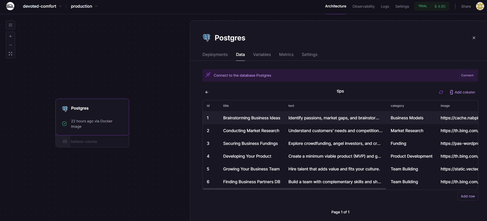

# WEB103 Project 2 - *IdeasPath*

Submitted by: **Mary Ramirez**

About this web app: **No matter what stage you are at opening up a business, we have a tutorial for you! Looking to brainstorm business ideas and find your niche? We can guide you in the right direction! Finding the right partner? Growing your team? Talking to suppliers? We have a short guide for each one of those. Our guides are sorted into different categories (including business models, product development, sales, market research, and funding) so you can browse or filter to personalize your experience.**

Time spent: **5** hours

## Required Features

The following **required** functionality is completed:

<!-- Make sure to check off completed functionality below -->
- [X] **The web app uses only HTML, CSS, and JavaScript without a frontend framework**
- [X] **The web app is connected to a PostgreSQL database, with an appropriately structured database table for the list items**
- [X] **The PostgreSQL database includes a table that matches the data displayed in the web app**
  - [X] **NOTE: Your GIF or a screenshot added to the README must include a view of your Railway database that shows the contents of the table used by your app**

The following **optional** features are implemented:

- [ ] The user can search for items with a specific attribute

The following **additional** features are implemented:

- [ ] List anything else that you added to improve the site's functionality!
## Video Walkthrough

**Note: please be sure to 

Here's a walkthrough of implemented required features:

Screenshot:

<!-- Replace this with whatever GIF tool you used! -->
GIF created with ScreenToGif
<!-- Recommended tools:
[Kap](https://getkap.co/) for macOS
[ScreenToGif](https://www.screentogif.com/) for Windows
[peek](https://github.com/phw/peek) for Linux. -->

## Notes

## License

Copyright [2024] [Mary Ramirez]

Licensed under the Apache License, Version 2.0 (the "License"); you may not use this file except in compliance with the License. You may obtain a copy of the License at

> http://www.apache.org/licenses/LICENSE-2.0

Unless required by applicable law or agreed to in writing, software distributed under the License is distributed on an "AS IS" BASIS, WITHOUT WARRANTIES OR CONDITIONS OF ANY KIND, either express or implied. See the License for the specific language governing permissions and limitations under the License.
